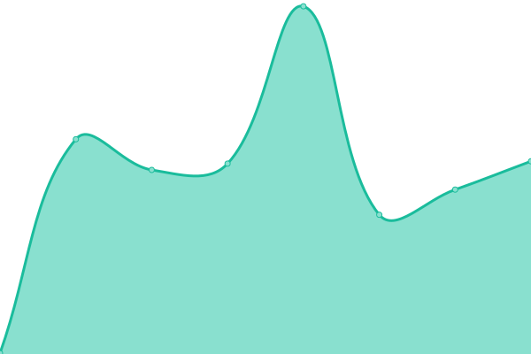

# [📈 Live Status](https://status.wltrs.nl): <!--live status--> **🟧 Partial outage**

This repository contains the open-source uptime monitor and status page for [Paul Wolters](https://paulwolters.com), powered by [Upptime](https://github.com/upptime/upptime).

With [Upptime](https://upptime.js.org), you can get your own unlimited and free uptime monitor and status page, powered entirely by a GitHub repository. We use [Issues](https://github.com/paulwolters/bih-upptime/issues) as incident reports, [Actions](https://github.com/paulwolters/bih-upptime/actions) as uptime monitors, and [Pages](https://status.wltrs.nl) for the status page.

<!--start: status pages-->
<!-- This summary is generated by Upptime (https://github.com/upptime/upptime) -->
<!-- Do not edit this manually, your changes will be overwritten -->
<!-- prettier-ignore -->
| URL | Status | History | Response Time | Uptime |
| --- | ------ | ------- | ------------- | ------ |
|  [BIH](https://www.betoninhuis.nl) | 🟩 Up | [bih.yml](https://github.com/paulwolters/up/commits/HEAD/history/bih.yml) | 

 275ms
     
 | 

<a href="https://status.wltrs.nl/history/bih">100.00%</a>
    

|  [FIT-nl](https://www.fit.nl) | 🟥 Down | [fit-nl.yml](https://github.com/paulwolters/up/commits/HEAD/history/fit-nl.yml) | 

 785ms
     
 | 

<a href="https://status.wltrs.nl/history/fit-nl">95.45%</a>
    

|  [PB-nl](https://www.parkerenbij.nl) | 🟩 Up | [pb-nl.yml](https://github.com/paulwolters/up/commits/HEAD/history/pb-nl.yml) | 

 599ms
     
 | 

<a href="https://status.wltrs.nl/history/pb-nl">100.00%</a>
    

<!--end: status pages-->

[**Visit our status website →**](https://status.wltrs.nl)

## 📄 License

- Powered by: [Upptime](https://github.com/upptime/upptime)
- Code: [MIT](./LICENSE) © [Paul Wolters](https://paulwolters.com)
- Data in the `./history` directory: [Open Database License](https://opendatacommons.org/licenses/odbl/1-0/)
